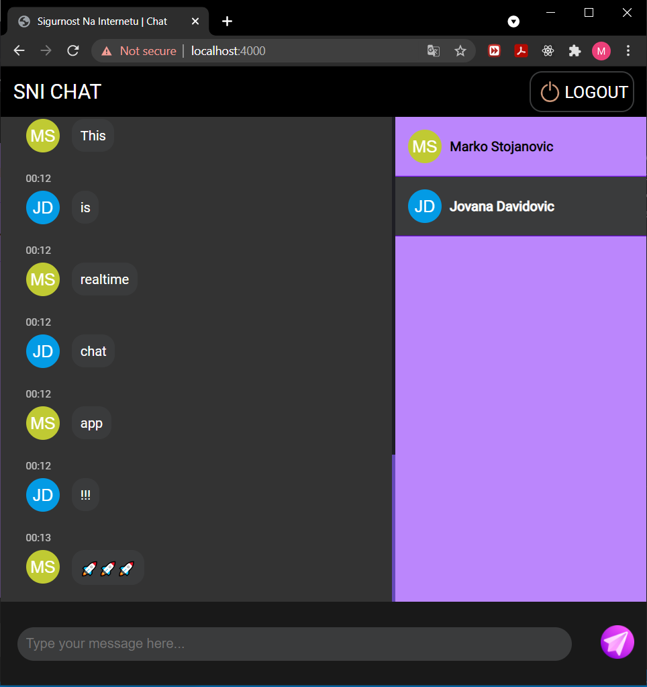

# SNI CHAT

1. ## Overview
   SNI chat is secure web application implemented using express.js and socket.io for real-time messaging. Application requires both server and client x509 certificates issuid by same CA. It uses **MFA** (Multi Factor Authentication) - step 1: username/password
   step 2: client certificate
   step 3: token sent to email that expires after three minutes. 
   Application also detecets and blocks any malicious users that attempt attacks (XSS, Injection, etc...)
2. ## Requirements
   1. Node.js v16.6
   2. MongoDB server
3. ## Instalation
   npm install
4. ## Preview
   